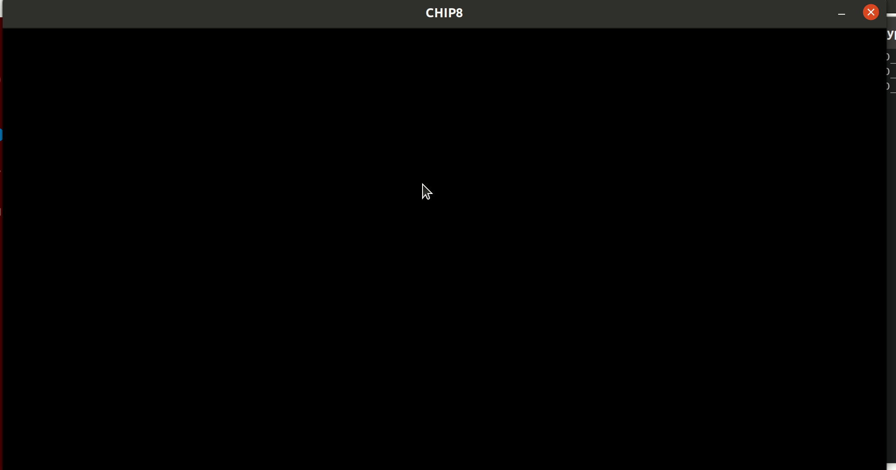

# CHIP8 Emulator

A CHIP8 emulator written in rust.

## Building

Make sure you have the latest version of Rust.

```sh
cargo build
```

## Running

This emulator reads binary files written with chip8 operations. A program might look something like this:

```sh
hexdump testbin/xy_neq_neq.chip8
0000000 0560 0661 1090 0170
0000008
```

The testbin folder has several examples of chip8 programs for each instruction.

To run a program, use the load operation followed by the file you wish to load:

```sh
chip_8_emulator load myChip8Prog.chip8
```

### colors

An optional arg can be used to set the color for the pixels, purple, green, blue, or red, the default is purple.

```sh
chip_8_emulator load myChip8Prog.chip8 blue
```

### Keyboard

The CHIP8 keyboard:

| 1 | 2 | 3 | c |
|---|---|---|---|
| 4 | 5 | 6 | d |
| 7 | 8 | 9 | e |
| a | 0 | b | f |

Is mapped to:

| 1 | 2 | 3 | 4 |
|---|---|---|---|
| q | w | e | r |
| a | s | d | f |
| z | x | c | v |

## Testing

```sh
cargo test
```

## Writing a program

### Drawing

| row | op | op | Description |
|-----|----|----|-------------|
| 0x200 | A2 | 06 | Set our address register to begin reading at location 206 |
| 0x202 | D0 | 05 | Draw at (0,0), 5 bytes starting from the location in memory specified by the address register |
| 0x204 | 00 | 00 | Halt |
| 0x206 | FF | C3 | The bytes that will be drawn |
| 0x208 | FF | C3 | |
| 0x210 | 00 |    | |

**Note that programs loaded into memory begin at location 0x200**

each pixel cooresponds to a set bit

```rust
// ******** 0xFF 0b1111_1111
// **    ** 0xC3 0b1100_0011
// ******** 0xFF 0b1111_1111
// **    ** 0xC3 0b1100_0011
// **    ** 0xC3 0b1100_0011
```

```sh
cargo build
./target/debug/chip_8_emulator load examples/draw_a.chip8
```

## Debugging



Debugging allows you to wait for enter to be pressed before the next operation is executed

```sh
cargo build
./target/debug/chip_8_emulator debug examples/a_plus_a.chip8
```

## TODO

* More tests
* Rewind
* Window size CLI param
* Print the ops of a program out with a description
* Second window for state in debug mode
* Displaying last op, next op in debug
